<div align="center">

</div>

<br>

```bash
┌──(noway㉿kali)-[~]
└─$ cat contact.sh
```

<div align="center">

[](https://github.com/nowaythefato)
[](https://linkedin.com/in/nowaythefato)
[](mailto:seu@email.com)

</div>

<br>

```bash
┌──(noway㉿kali)-[~]
└─$ exit
```

<div align="center">


</div>
