<div align="center">

<!-- ── [1] BOOT SEQUENCE ─────────────────────────────────────── -->


─────────────────────────────────────────────────────

<!-- ── [2] ASCII AVATAR ──────────────────────────────────────── -->



</div>

<br>

<!-- ── [3] WHOAMI ────────────────────────────────────────────── -->

```bash
┌──(noway㉿kali)-[~]
└─$ whoami
```

<div align="center">


─────────────────────────────────────────────────────

</div>

<!-- ── [4] SOBRE MIM ─────────────────────────────────────────── -->

```bash
┌──(noway㉿kali)-[~]
└─$ cat sobre-mim.txt
```

<div align="center">


─────────────────────────────────────────────────────

</div>

<!-- ── [5] STACK ─────────────────────────────────────────────── -->

```bash
┌──(noway㉿kali)-[~]
└─$ cat stack.txt
```

<div align="center">


<br><br>

**`// backend`**

[](https://nodejs.org)
[](https://expressjs.com)
[](https://redis.io)
[](https://www.postgresql.org)
[](https://www.prisma.io)

**`// frontend`**

[](https://react.dev)
[](https://www.typescriptlang.org)

**`// cloud & devops`**

[](https://www.docker.com)
[](https://aws.amazon.com)

─────────────────────────────────────────────────────

</div>

<!-- ── [6] GITHUB STATS ──────────────────────────────────────── -->

```bash
┌──(noway㉿kali)-[~]
└─$ fetch --github-stats
```

<div align="center">


<br><br>


<br><br>


─────────────────────────────────────────────────────

</div>

<!-- ── [7] CONTACT ───────────────────────────────────────────── -->

```bash
┌──(noway㉿kali)-[~]
└─$ cat contact.sh
```

<div align="center">

[](https://github.com/nowaythefato)
[](https://linkedin.com/in/arthur-henrique-351386213)
[](mailto:artkkj@icloud.com)

─────────────────────────────────────────────────────

</div>

<!-- ── [8] EXIT ──────────────────────────────────────────────── -->

```bash
┌──(noway㉿kali)-[~]
└─$ exit
```

<div align="center">


<br><br>


</div>