<!-- ── TERMINAL SESSION (boot → ascii → whoami → sobre-mim → stack → contact → exit, em loop) ── -->

  

─────────────────────────────────────────────────────

<!-- ── STACK (badges clicáveis) ──────────────────────────────── -->

**`// backend`**

**`// frontend`**

**`// cloud & devops`**

─────────────────────────────────────────────────────

<!-- ── GITHUB STATS ──────────────────────────────────────────── -->

**`// github stats`**

  

─────────────────────────────────────────────────────

<!-- ── CONTACT ───────────────────────────────────────────────── -->

**`// contact`**

 

